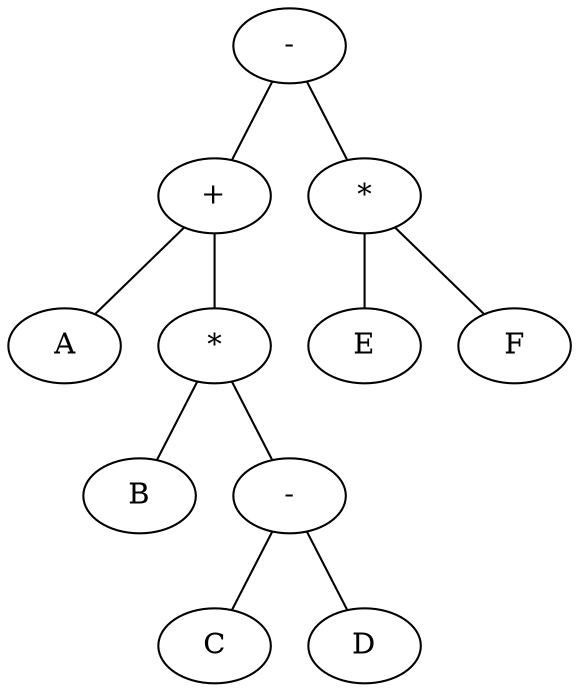

## 表达式的说明
前序遍历，中序遍历，后序遍历，其中的前中后是对二叉树中根节点的遍历次序来定义的

先遍历 根节点，再遍历左子树，再遍历右子树为前序遍历
先遍历左子树，再遍历根节点，再遍历右子树为中序遍历
先遍历左子树，再遍历右子树，再遍历根节点为后序遍历

而前缀，中缀，后缀表达式就是对语法树的前序，中序，后序遍历后的结果，其名是相一致的。


## 中缀表达式

` A + (B * (c - D)) - E * F`
 
 生成语法树如下所示



## 前缀表达式
将这个语法树进行前序遍历 

` - + A * B - C D * E F`

### 基本算法
* 从左往右将字符入栈
* 操作符后面跟着两个操作数则进行运算
* 将运算的结果作为操作数替换这个操作符和两个操作数
* 当最后一个字符入栈结束后，最后留在栈顶的字符就是最后的结果

可以通过栈来实现

```graphviz
digraph{
    
    rankdir = LR
    node[fontname = "Verdana", fontsize = 10, color="skyblue", shape="box" ]
    stack_1 [shape = record,label="||||||||||"]
    stack_2 [shape = record,label="||||||||||-"]
    stack_3 [shape = record,label="|||||||||+|-"]
    stack_4 [shape = record,label="||||||||A|+|-"]
    stack_5 [shape = record,label="|||||||*|A|+|-"]
    stack_6 [shape = record,label="||||||B|*|A|+|-"]
    stack_7 [shape = record,label="|||||-|B|*|A|+|-"]
    stack_8 [shape = record,label="||||C|-|B|*|A|+|-"]
    stack_9 [shape = record,label="|||D|C|-|B|*|A|+|-"]
    stack_10 [shape = record,label="||||||B|*|A|+|-"]
    stack_11 [shape = record,label="|||||G|B|*|A|+|-"]
    stack_12 [shape = record,label="||||||||A|+|-"]
    stack_13 [shape = record,label="|||||||H|A|+|-"]
    stack_14 [shape = record,label="||||||||||-"]
    stack_15 [shape = record,label="|||||||||I|-"]
    stack_16 [shape = record,label="||||||||*|I|-"]
    stack_17 [shape = record,label="|||||||E|*|I|-"]
    stack_18 [shape = record,label="||||||F|E|*|I|-"]
    stack_19 [shape = record,label="|||||||||I|-"]
    stack_20 [shape = record,label="||||||||J|I|-"]
    stack_21 [shape = record,label="||||||||||k"]
    stack_22 [shape = record,label="||||||||||"]
    

    stack_1 -> stack_2 -> stack_3 -> stack_4 -> stack_5 -> stack_6 -> stack_7->
    stack_8 -> stack_9 ->stack_10 -> stack_11 -> stack_12 -> stack_13 -> stack_14 ->
    stack_15 -> stack_16 ->stack_17 -> stack_18 -> stack_19 -> stack_20 -> stack_21 -> stack_22
   
}
```




下面是c的具体实现
```c
bool is_operator(char c)
{
    if (c == '+' || c == '-' || c == '*' || c == '/')
        return true;
    else
        return false;
}

bool is_number(char c)
{
    if(c >= '0' && c <= '9'>)
        return true;
    else 
        return false;
}


/*
*  brief 计算 a op b的值
*
*  不包含错误处理
*
*  @param a input 
*  @param b input 
*  @param op input 包括了 + - * /
*
*  sample 例如 'a + b '
*/
int calculate_op(int a, int b, char op)
{
    int result;
    switch(op){
    case '-':
        resullt = a - b;
        break;
    case '+':
        result = a + b;
        break;
    case '*':
        result = a * b;
        break;
    case '/':
        if (b == 0)
            result = INIF
        else 
            result = a / b;
        break;
    default :
    }
    return result;
}

/*
*  brief 前缀表达式运算
*
*  假定输入的值都是正确的
*  
*  @param prefix_expression 传入的前缀表达式
*  return 运算结果
*
*  sample "- 1 3" 获得 -2 
*/
int prefix_expression_calculate(const char *prefix_expression)
{
    char *p = prefix_expression;
    char *pre = prefix_expression;
    stack stack_future;

    while (*p != '\0')
    {
        if(*p == ' '){
            p++;
            continue;
        }
        else if(is_opreator(*P)){
            stack_future.push(*p);
            pre = p;
            p++;
        }
        else if((p != prefix_expression) && is_number(*p) && is_number(*pre)){
            // 减法和除法需要顺序
            int number_oped = stack.pop() + '0';
            int number_op = stack.pop() + '0';
            char op = stack.pop();
            int new_number = calculate_op(number_op,number_oped,op); 
            stack.push(new_number);
            pre = p;
            p++;
        }

    }
    int result = stack.pop();
    return result;
}
```

## 后缀表达式
将上述语法树进行后序遍历
`A B C D - * + E F * -`

### 基本算法
* 从左往右将字符入栈
* 当出现运算符的时候就将栈中的两个元素弹出
* 计算弹出元素的值将其压入栈中

```graphviz
digraph{
    
    rankdir = LR
    node[fontname = "Verdana", fontsize = 10, color="skyblue", shape="box" ]
    stack_1 [shape = record,label="||||||||||"]
    stack_2 [shape = record,label="||||||||||A"]
    stack_3 [shape = record,label="|||||||||B|A"]
    stack_4 [shape = record,label="|||||||D|C|B|A"]
    stack_5 [shape = record,label="||||||-|D|C|B|A"]
    stack_6 [shape = record,label="|||||||||B|A"]
    stack_7 [shape = record,label="||||||||G|B|A"]
    stack_8 [shape = record,label="|||||||*|G|B|A"]
    stack_9 [shape = record,label="||||||||||A"]
    stack_10 [shape = record,label="|||||||||H|A"]
    stack_11 [shape = record,label="||||||||+|H|A"]
    stack_12 [shape = record,label="||||||||||I"]
    stack_13 [shape = record,label="|||||||||E|I"]
    stack_14 [shape = record,label="||||||||F|E|I"]
    stack_15 [shape = record,label="|||||||*|F|E|I"]
    stack_16 [shape = record,label="||||||||||I"]
    stack_17 [shape = record,label="|||||||||J|I"]
    stack_18 [shape = record,label="||||||||-|J|I"]
    stack_19 [shape = record,label="||||||||||"]
    stack_20 [shape = record,label="||||||||||K"]
    stack_21 [shape = record,label="||||||||||"]

    stack_1 -> stack_2 -> stack_3 -> stack_4 -> stack_5 -> stack_6 -> stack_7->
    stack_8 -> stack_9 ->stack_10 -> stack_11 -> stack_12 -> stack_13 -> stack_14 ->
    stack_15 -> stack_16 ->stack_17 -> stack_18 -> stack_19 -> stack_20 -> stack_21
   
}
```



下面是c的具体实现
``` c

bool is_operator(char c)
{
    if (c == '+' || c == '-' || c == '*' || c == '/')
        return true;
    else
        return false;
}

bool is_number(char c)
{
    if(c >= '0' && c <= '9'>)
        return true;
    else 
        return false;
}


/*
*  brief 计算 a op b的值
*
*  不包含错误处理
*
*  @param a input 
*  @param b input 
*  @param op input 包括了 + - * /
*
*  sample 例如 'a + b '
*/
int calculate_op(int a, int b, char op)
{
    int result;
    switch(op){
    case '-':
        resullt = a - b;
        break;
    case '+':
        result = a + b;
        break;
    case '*':
        result = a * b;
        break;
    case '/':
        if (b == 0)
            result = INIF
        else 
            result = a / b;
        break;
    default :
    }
    return result;
}

/*
*  brief 后缀表达式运算
*
*  假定输入的值都是正确的
*  
*  @param suffix_expression 传入的后缀表达式
*  return 运算结果
*
*  sample "1 3 -" 获得 -2 
*/
int suffix_expression_calculate(const char *suffix_expression)
{
    char *p = suffix_expression;
    char *pre = suffix_expression;
    stack stack_future;

    while (*p != '\0')
    {
        if(*p == ' '){
            p++;
            continue;
        }
        else if(is_operator(*p))
        {
            int number_oped = stack.pop() + '0';
            int number_op = stack.pop() + '0';
            char op = stack.pop();
            int new_number = calculate_op(number_op,number_oped,op);
            stack.push(new_number);
            pre = p;
            p++;
        }
        else if(is_number(*p))
        {
             stack_future.push(*p);
            pre = p;
            p++;
        }

    }
    int result = stack.pop();
    return result;
}
```

## 中缀表达式转后缀表达式
 ` A + (B * (c - D)) - E * F` ->  `A B C D - * + E F * -`
 ### 基本算法
 1. 从左到右扫描每一个字符，如果扫描到的字符是操作数，就直接输出这些操作数
 2. 如果扫描到的字符是一个操作符，分三种情况：
  * 如果堆栈是空的，直接将操作符存储到堆栈中
  * 如果该操作符优先级大于栈顶的操作符，将直接将操作符存储到堆栈中
  * 如果该操作符的优先级低于对战出口的操作符，就将堆栈出口的操作符弹出，知道该操作符的优先级大于栈顶的操作符
3. 如果遇到“（”，将操作符输出到堆栈中，如果遇到 “）”，将堆栈中的操作符弹出，直到“（”，移除“（”“）”，继续扫描
4. 如果扫描结束，则弹出栈中所有的操作符

### 基本说明 
1. 一个栈来存储操作符
2. 一个栈用来存放结果

下面是 c 的实现
```c

int get_op_pro(char op)
{
    int pro;
    switch (op){
      case '+':
       pro = 0;
       break;
    case '-':
       pro = 0;
       break;
    case '*':
       pro = 1;
       break;
    case '/':
       pro = 1;
       break;
    default:
       pro = -1;
    }
    return pro;
}

bool is_operator(char c)
{
    if (c == '+' || c == '-' || c == '*' || c == '/')
        return true;
    else
        return false;
}

bool is_number(char c)
{
    if(c >= '0' && c <= '9'>)
        return true;
    else 
        return false;
}

/*
*  brief 中缀表达式转换为后缀表达式
*
*  @express input 中缀表达式
*/
char* mid2suff(char* express)
{
    char *p = express;
    stack op_stack;
    stack rc_stack;
    while(*p != '\0')
    {
        if(*p == ' '){
            p++;
            continue;
        }
        else if(is_number(*p))
        {
            rc_stack.push(*p);
        }
        else if(is_operator(*p))
        {
            if(op_stack.empty()) || get_op_pro(op_stack.top()) < get_op_pro(*p))
            {
                op_stack.push(*p);
            }
            else 
            {
                while(!op_stack.empty() && get_op_pro(op_stack.top()) > get_op_pro(*p))
                {
                    rc_stack.push(op_stack.pop());
                }
            }
        }
        else if (*p == '(')
        {
            op_stack.push(*p);
        }
        else if (*p == ')')
        {
            while(op_stack.top() != '('){
                rc_stack.push(op_stack.pop());
            }
            op_stack.pop();
        }
        p++;
    }
    int size = rc_stack.size();
    char *suffix_express = malloca(size*sizeof(char));
    for(int i = 0; i < size; i++)
    {
        suffix_express[i] = rc_stack[i];
    }
    return suffix_express;
}
```
